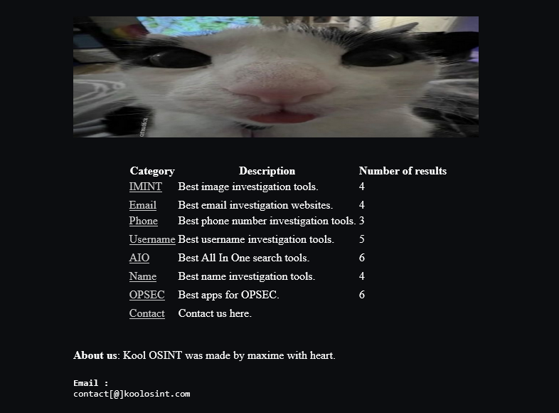

# Kool OSINT

A simple web directory of OSINT (Open Source Intelligence) tools I built in **September 2023** during my first year of college, to share with classmates so they could discover and use OSINT tools.

> **Note:** Given my knowledge at the time, the tool selection is limited and some entries may now be outdated.

## Categories

| Category | Description |
|----------|-------------|
| **IMINT** | Image intelligence — tools for investigating and analyzing images |
| **Email** | Tools for email address lookups and investigations |
| **Phone** | Tools for phone number investigations |
| **Username** | Tools for tracking and investigating usernames across platforms |
| **AIO** | All-In-One search tools that combine multiple OSINT capabilities |
| **Name** | Tools for investigating real names |
| **OPSEC** | Apps and tools for operational security |
